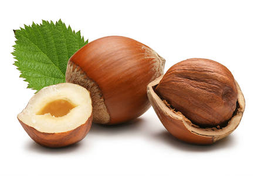
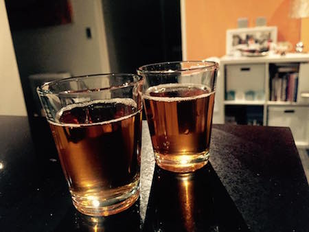

# Hazelnut vodka (orzechówka)

This is our recipe for hazelnut-infused vodka. It’s a homemade version of Soplica hazelnut.

# TTFS 

The estimated time-to-first-shot.

| Part 1| Part 2| Total |
|:-:|:-:|:-:|
| 2-3 weeks | 2-3 weeks | **4-5 weeks** |

# Ingredients

- 1.5 glass of hazelnuts
- 1 liter of vodka (Absolut or any other)
- 1.5 glass of sugar
- 2 glasses of water
- 1 vanilla bean
- 2 allspice grains

# Plan of attack

## Part 1: The hazelnut elixir
***

It's great if you can get whole hazelnuts in shells, but if you can't, the ones in skins are ok too.

### Peel the hazelnuts

Remove the skins by roasting and rubbing. First, roast the hazelnuts in the oven for ~10 mins in 175 C until they get a bit darker and you can smell the hazelnut magic.

When the nuts are still hot, put them in a kitchen cloth and rub a bit. Leave them to cool down and rub again until the skins are gone.

### Mix & match

Find a container (for example, a jar or a bottle) that will fit the ingredients and vodka. You'll have to seal it for a couple of weeks.

Crush or chop the nuts and put them in the container. Add the vanilla bean (sliced in two), and allspice.

Add vodka.

Close the container and let the hazelnuts soak for two or three weeks. 

## Part 2: Aging
***

After two or three weeks, you can work with the elixir again.

### Chill and distill

Separate the liquid from the hazelnuts and strain the liquid through paper coffee filters. Now your elixir should be clear.

### Add sweetness and texture

To get the final taste, prepare some sugar syrup and mix it with the elixir.

Boil two glasses of water. Once the water starts boiling, add sugar. Stir until sugar dissolves. Allow the syrup to cool.

Keep adding syrup to the vodka until you think it’s sweet enough. 

Put your hazelnut vodka in a sealed container in a cool dark place and let it age for another 2 weeks.

# Result

